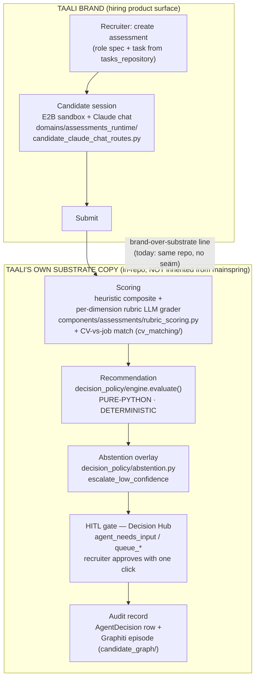

# Taali — Platform Architecture (Design Handoff)

> **Owner:** `tali-platform` · **Last validated against code:** 2026-05-30 (platform audit) ·
> **Known gaps:** TAA-8, TAA-9, TAA-10, TAA-11, TAA-12, TAA-22, TAA-28, TAA-29, TAA-30

**Audience:** Claude Design + investors / technical readers.
**Mandate:** truth over reassurance. This doc distinguishes what is **shipped**
(running in production), **designed** (built but not the live path), and
**dormant** (present in the tree but with no live caller). Every load-bearing
claim is grounded in a code path. Where a prior review claim and the code
disagreed, the reconciliation is stated inline rather than smoothed over.

---

## 1. Objective

Taali makes hiring decisions **defensible** by capturing how a candidate actually
works with AI — the prompts, iterations, abstentions, recoveries — and turning
that into a structured, auditable, role-fit-grounded recommendation a recruiter
and a regulator can both stand behind (`NORTH_STAR.md`, "Objective").

This repository, `tali-platform`, **is the live Taali product** — not a brand
shell, not a prototype. It is a standalone **FastAPI monolith** of **~100.9k LoC**
under `backend/app/` (11 domains in `backend/app/domains/*`, plus the substrate
packages `candidate_graph/`, `decision_policy/`, `agent_runtime/`, `llm/`,
`cv_matching/`). It is wired end-to-end and the **product works**: the Phase-3
audit measured **≈293/295 core-flow tests passing** (218 backend test files
total under `backend/tests/`).

> **Lineage micro-note.** The ≈293/295 pass-rate is **carried forward** from the
> Phase-3 audit (the 2026-05-29/30 isolation runs); it was **not re-executed in
> this doc pass**. Treat it as a cited prior measurement, not a fresh run of this
> artefact.

> **Lineage note.** `NORTH_STAR.md` opens with a *reconciliation note*: the
> central `north-star/` model still labels `tali-platform` "legacy" and treats a
> separate `taali-brand` repo as the brand. Per **ADR-0009 (Proposed)**, this
> repo is the canonical live Taali; that flip is **proposed, not ratified**. This
> doc adopts the ADR-0009 framing and flags the drift honestly — it is **not** a
> settled fact in the platform-level source of truth yet.

---

## 2. What is "brand" vs what is (not yet) inherited

**Standalone today; convergence is a future program.** This is the single most
important honest framing in this document.

Taali's North Star (principle 3) states: *"EEOC/fair-hiring posture is **inherited
from Mainspring**, not bolted on. When the substrate adds compliance rule packs,
Taali consumes them."* **The code does not match this principle today.**

- **Backend coupling to Mainspring: zero.** `grep -rn "import mainspring|from
  mainspring" backend/app` returns **nothing**. There are **0 mainspring backend
  imports**. Taali does not run *on* the mainspring substrate — it **hosts its own
  parallel copy** of the substrate, i.e. the very system that mainspring was later
  generalised *from*. Every "substrate" capability below is **locally owned code
  in this repo**, not an inherited dependency.

- **Fair-hiring is local, not inherited (TAA-9).** The EEOC bias audit
  (`backend/app/decision_policy/bias_audit.py`) and promotion gate
  (`promotion_gate.py`) are implemented *in this repo*. This directly contradicts
  NORTH_STAR principle 3. The principle describes the *intended* end-state; the
  code is the *current* state. They are not the same, and the gap is material to
  any compliance claim.

The only two real ties to Mainspring are thin and, today, inert or cosmetic — see
§6. Everything else is Taali's own.

---

## 3. The assessment → scoring → decision → audit flow

This is the **shipped** core product path.

Path detail (all shipped):

1. **Create** — recruiter creates an assessment against a role spec; tasks come
   from `tasks_repository`.
2. **Session** — candidate works in an **E2B sandbox** with a **Claude chat**
   (`domains/assessments_runtime/candidate_claude_chat_routes.py`,
   `candidate_runtime_routes.py`). The session log is the artefact (NORTH_STAR
   principle 1).
3. **Submit → score** — heuristic composite **plus** a per-dimension **rubric LLM
   grader** (`components/assessments/rubric_scoring.py`,
   `RubricScorer.grade_dimension` (rubric_scoring.py:422) → `messages.create`
   (rubric_scoring.py:438)) **plus** CV-vs-job match (`cv_matching/`).
4. **Recommend** — `decision_policy/engine.py::evaluate(inputs, *, db)`. This is
   **pure-Python and deterministic**: it loads the active policy, validates the
   `PolicyJson` schema, and never raises to the caller (any failure collapses to
   `decision_type="no_action"` with populated `reasoning`). No LLM in the verdict
   step.
5. **Abstain if uncertain** — `decision_policy/abstention.py` overlays three
   independent `escalate_low_confidence` triggers (per-agent uncertainty,
   sub-agent disagreement, calibrated-confidence floor).
6. **HITL** — the verdict is a **recommendation**, not an action. It lands in the
   **Decision Hub** (`domains/agentic/`, `models/agent_needs_input.py`) and the
   recruiter approves/overrides with one click (NORTH_STAR non-goal: "we do not
   generate hire/no-hire verdicts that bypass a human recruiter").
7. **Audit** — one `AgentDecision` row (`models/agent_decision.py`) **plus** a
   durably-enqueued Graphiti episode. The durability is real and worth stating
   precisely: `actions/queue_decision.py::_emit_decision_episode_safe`
   (queue_decision.py:531) writes a `graph_episode_outbox` row **in the same
   transaction** as the `AgentDecision`, and `candidate_graph/episode_outbox.py`
   (episode_outbox.py:200) plus the beat task
   `graph_outbox_tasks.drain_graph_episode_outbox` drain that outbox to Graphiti
   **with retry** — so a graph outage cannot silently drop an episode.
   **Caveat:** bulk/threshold decisions set `skip_episode=True`
   (queue_decision.py:508) — they still get a durable Postgres `AgentDecision`
   row but **no Graphiti episode**. So every recommendation is replayable
   **unconditionally via Postgres**, and **conditionally via the knowledge graph**
   (only for non-skipped decisions).

---

## 4. Taali's own substrate stack

These are **production-grade and shipped** — and **locally owned**. They mirror
mainspring's capabilities because mainspring was generalised *from this code*, not
the other way around.

| Capability | Code | State | Notes |
|---|---|---|---|
| **Bi-temporal knowledge graph** | `backend/app/candidate_graph/` (`client.py`, `episodes.py`, `search.py`, `episode_outbox.py`) | **shipped** | `candidate_graph` on **Graphiti / Neo4j / Voyage**. Per-tenant isolation via Graphiti `group_id` (search filters on `group_id` by construction). Outbox drained by beat (`drain-graph-episode-outbox-every-5-minutes`). |
| **Metered LLM gateway** | `backend/app/llm/core.py` (`MeteredAnthropicClient`), `services/metered_anthropic_client.py` | **shipped, CI-gated** | Every Anthropic call writes a `UsageEvent`. Note the lead single-source test `tests/test_metering_single_source.py` is **cv_match-scoped** (it proves one-event-per-call only for the cv_match runner); the **platform-wide** "every Anthropic call writes a `UsageEvent`" claim rests on the **architecture-gate test** `tests/test_ci_architecture_gates.py` (plus `test_anthropic_wire_tap.py`), which **gate-enforces** that every Anthropic client is wrapped in `MeteredAnthropicClient` — i.e. it is enforced by the gate, not proven by that one cv_match test. Mirrors mainspring's gateway. |
| **HITL / Decision Hub** | `domains/agentic/hub_routes.py`, `models/agent_needs_input.py` | **shipped** | `agent_needs_input` queue; recruiter approval surface. |
| **Budget governor (hard cap)** | `agent_runtime/budget_guard.py`, `token_spend_aggregator.py` | **shipped** | Agent-on roles self-pause at a monthly USD cap (default $50); resume is manual (`agent_paused_at`). Hard cap, not advisory. |
| **Abstention overlay** | `decision_policy/abstention.py` | **shipped** | See §3 step 5. |

---

## 5. Governance gap — dead promotion gate + un-run bias audit (TAA-28)

This is the most consequential **honesty correction** in the audit, because the
earlier review framing and the code framing differ in a way that matters for the
fair-hiring claim.

**Earlier-review claim:** the promotion gate + EEOC bias-audit governance loop is
*"DEAD CODE (zero callers, never scheduled)."*

**What the code actually shows (reconciled):** the loop is **wired but
structurally inert** — which is worse to leave unstated, so here it is precisely:

- The bias-audit / promotion-gate path **is reachable from a scheduled task**:
  celery beat entry `decision-policy-nightly-retune` →
  `tasks/decision_policy_tasks.py::nightly_retune_sweep` →
  `decision_policy/nightly_retune.py::run_for_all_orgs` → `run_for_org` →
  `promotion_gate.evaluate_auto_apply`. So the earlier "dead code / zero callers /
  never scheduled" framing is **not literally true** — there *is* a beat caller.
  The accurate label is **scheduled-but-inert / dormant**, not "never scheduled."
- **But it is structurally inert** — the gate never actually audits anything,
  for two independent reasons:
  1. **`decision_policy_auto_apply` defaults `False` with no enable surface.**
     `run_for_org` only calls the gate when `_auto_apply_enabled(org)` is true,
     which reads `org.workspace_settings["decision_policy_auto_apply"]`,
     **defaulting to `False`** (nightly_retune.py:63). No surface sets it. So in
     production the gate branch is never entered.
  2. **`run_for_all_orgs` never passes `audit_examples`, so the bias audit runs
     on `[]` and fails closed.** `run_for_all_orgs` calls
     `run_for_org(db, organization_id=oid)` **without passing `audit_examples`**
     (nightly_retune.py:272), so even if auto-apply were enabled the gate receives
     `audit_examples or []` (nightly_retune.py:226) — an **empty
     protected-attribute set**. The function's own docstring says protected
     attributes are *"deliberately kept out of production data"* and the curated
     compliance set must be *"supplied by the caller"*. No caller supplies it. The
     gate therefore **fails closed / cold-starts** and writes the policy
     **inactive for human review**.

**Net effect:** policy changes are effectively **ungated in the live path** (the
deterministic engine still runs, but *promotion* of a re-tuned policy never
auto-applies and is never bias-audited against real protected-attribute data), and
the **EEOC fair-hiring audit has no live caller feeding it real data**. The
machinery exists; the compliance loop does not run. State it as: **dormant
governance, not active governance.** This is TAA-28, and it compounds TAA-9
(fair-hiring is local *and* not actually exercised).

---

## 6. Relationship to Mainspring

Two ties, both thin.

### 6.1 Flag-off `brain_feed` emitter — *dormant*

- Lives on `origin/main`: `backend/app/brain_feed/{outbox,sweep}.py`,
  `models/brain_feed_outbox.py`, `tasks/brain_feed_tasks.py`, migration
  `108_add_brain_feed_outbox.py`.
- **Default off:** `platform/config.py` →
  `MAINSPRING_BRAIN_FEED_ENABLED: bool = False`. The sweep short-circuits:
  `if not settings.MAINSPRING_BRAIN_FEED_ENABLED: return`.
- It writes **usage rollups only** (config comment: *"never PII/free-text/raw
  ids"*) into a **local** `brain_feed_outbox` table. Per the audit, even when
  enabled the **mainspring receiver does not read the landing table** — so this is
  an emitter with no consumer. **Dormant on both ends.**

### 6.2 Vendored frontend tokens + one component — *shipped, cosmetic*

- `frontend/src/index.css` imports `./styles/00-tokens.css`, which is a
  **vendored copy** of `@mainspring/tokens` (header: *"VENDORED from
  @mainspring/tokens … GENERATED by scripts/vendor_mainspring_tokens.sh — do NOT
  hand-edit"*). Taali selects its palette via `data-brand="taali"`.
- This is **one consuming import of a copied stylesheet** (plus one vendored UI
  component). It is a build-time copy, **not** a runtime or package dependency on
  mainspring.

**So the entire relationship to mainspring today is:** a standalone product that
**copies a stylesheet + one component**, plus a **flag-off, unread** telemetry
emitter. There is no shared substrate at runtime.

### 6.3 The convergence backlog (TAA-29)

Putting Taali *on* mainspring (consuming its substrate rather than hosting a
parallel copy) is a **~14–17k LoC, multi-quarter program**, and **mainspring does
not yet expose the seams** to do it (no stable substrate API for KG / metering /
decision-policy / HITL that Taali could bind to). Convergence is a **future
program**, not a near-term migration. Anyone reading "brand on a substrate" should
read it as **aspiration backed by an ADR proposal**, not current wiring.

---

## 7. Empirical state vs designed state

| Area | State | Evidence |
|---|---|---|
| Core flow (create → session → score → recommend → HITL → audit) | **shipped, works E2E** | ≈293/295 core-flow tests pass (Phase-3 audit, carried forward — see §1 lineage micro-note); routes + engine + audit rows verified. Audit is replayable **unconditionally via the Postgres `AgentDecision` row**; the Graphiti episode is **conditional** — bulk/threshold decisions set `skip_episode=True` (queue_decision.py:508) and write a Postgres row but no graph episode |
| Deterministic recommendation engine | **shipped** | `decision_policy/engine.py::evaluate` — pure-Python, never raises |
| KG / metering / HITL / budget / abstention | **shipped** | §4 code paths |
| Rubric LLM grader determinism | **NOT deterministic** | `rubric_scoring.py` `messages.create` passes **no `temperature`** → model default (TAA-8) |
| Promotion gate + EEOC bias audit (live) | **dormant** | wired via beat but inert (auto-apply default-off; empty `audit_examples`) (TAA-28) |
| Fair-hiring inheritance from mainspring | **not built** | local impl; 0 mainspring imports; contradicts NORTH_STAR §3 (TAA-9) |
| Agent off-policy guardrail | **convention-only** | `queue_*` tools don't require a prior `evaluate_policy` verdict (TAA-22) |
| `brain_feed` → mainspring | **dormant** | flag default-off; receiver doesn't read (§6.1) |
| Taali-on-mainspring convergence | **designed (backlog)** | ~14–17k LoC; seams not exposed (TAA-29) |

---

## 8. Known gaps (TAA tickets)

- **TAA-8 — Rubric LLM scoring is non-deterministic.**
  `components/assessments/rubric_scoring.py::grade_dimension` (rubric_scoring.py:422)
  calls `messages.create` (rubric_scoring.py:438) **without `temperature=0`**. Contrast the deterministic paths
  that *do* pin it (`cv_matching/pairwise.py` `temperature=0.0`,
  `runner_pre_screen.py` `temperature=0`, several `services/*` callers). This
  violates NORTH_STAR principle 4 (*"two candidates with the same evidence get the
  same score, full stop"*): per-dimension grades can drift run-to-run.

- **TAA-9 — Fair-hiring is locally implemented, not inherited.** Contradicts
  NORTH_STAR principle 3. The bias audit / promotion gate live in
  `decision_policy/` in *this* repo; nothing is consumed from mainspring (0
  backend imports). Compounds TAA-28: the local implementation is also dormant.

- **TAA-10 / TAA-11 / TAA-12 — (tracked).** Reserved in the audit's gap set for
  this repo; carry them on the ticket tracker. *Do not* infer their content here —
  they were not re-verified against code in this pass, so this doc does not assert
  their state. Treat as "open, unverified in this artefact."

- **TAA-22 — Agent runtime can compose an off-policy verdict.** The queue tools
  (`agent_runtime/tool_registry.py`: `queue_advance_decision`,
  `queue_reject_decision`, `queue_skip_assessment_reject_decision`) accept a free
  `reasoning` + `confidence` and **do not require** a prior `evaluate_policy`
  result. The "ALWAYS run evaluate_policy first … when the policy says skip you do
  NOT queue" rule lives **only in the system prompt** (`system_prompt.py`
  ~lines 160-161). It is **convention, not structure** — a model that ignores the
  instruction can queue a verdict the deterministic engine would not have emitted.
  (The HITL recruiter approval in §3 step 6 is the real backstop today.)

- **TAA-28 — Governance loop is dormant.** See §5. Promotion gate + EEOC bias
  audit are wired to beat but never run against real data (auto-apply default-off;
  empty `audit_examples`). Policy promotion is ungated in practice and the
  fair-hiring audit has no live data-bearing caller.

- **TAA-29 — Convergence onto mainspring is unbuilt.** ~14–17k LoC, multi-quarter;
  mainspring doesn't yet expose the substrate seams (§6.3).

- **TAA-30 — (tracked).** Reserved in the audit's gap set; carry on the tracker.
  Not re-verified in this artefact.

---

## 9. One-paragraph honest summary for the reader

Taali (`tali-platform`) is a **shipped, working, standalone** AI-native hiring
product: a ~100.9k-LoC FastAPI monolith whose assessment → scoring → deterministic
recommendation → human-in-the-loop → audit flow runs end-to-end (≈293/295
core-flow tests pass), on its **own** production-grade substrate (bi-temporal KG,
CI-gated metered LLM gateway, Decision Hub HITL, hard-cap budget governor,
abstention overlay). It is **not** on the mainspring substrate — it hosts a
parallel copy of the system mainspring was generalised *from*, with **zero
mainspring backend imports**; the only ties are a **flag-off, unread** `brain_feed`
emitter and a **vendored stylesheet + one component**. The North Star's "brand on
the mainspring substrate, fair-hiring inherited" framing is **aspirational, not
current** (TAA-9), and **convergence is a multi-quarter future program** for which
mainspring's seams don't yet exist (TAA-29). The product's sharpest internal gaps
are that the **rubric grader is non-deterministic** (TAA-8, breaking the
determinism principle) and that the **promotion-gate + EEOC bias-audit governance
loop, though wired, never runs against real data** (TAA-28) — so policy promotion
is effectively ungated and the fairness audit is dormant. Believe the core
product; **discount the governance and convergence story until the code catches up
to the principles.**
