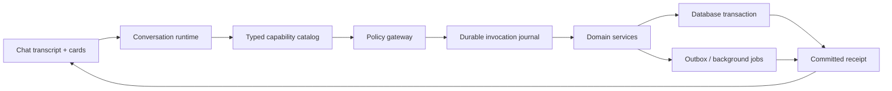

# Chat-first platform review

## Executive verdict

Tali already contains most of the domain machinery needed for an end-to-end
chat product. The missing layer is a single, governed capability surface that
lets chat discover, invoke, explain, and resume that machinery safely.

There are four useful but still partly disconnected agent surfaces:

| Surface | Strength today | Main gap |
|---|---|---|
| Global Search / Ask | 16 candidate, role, CV, graph, agent-history, assessment, and recruiting-overview reads | No durable mutation lifecycle yet |
| Role Agent Chat | 34 role-scoped read, helper, diagnostic, and command tools with transcript/event cards | Stage/outcome, assessment-send, interview, sharing, and general operation-event commands remain |
| Requisition intake chat | Attachment-driven brief generation | Publish/share completion still leaves chat |
| Public MCP | 11 authenticated read tools from the shared catalog | Smaller exposure than Search / Ask; role and autonomous tools remain separate |

The vision is viable, but adding action functions directly to the current
global chat loop would be unsafe. The current streaming transaction can show a
successful tool result before the outer request commits. If a later model call
fails or the client disconnects, a database mutation can roll back after the
recruiter saw success. An external effect such as email could already have
happened. That boundary must be fixed before global chat gains write tools.

## Implementation status — 15 July 2026

This build closes the first end-to-end command slice in **Role Agent Chat**:

- The promptable role-chat catalog grew from 19 to 34 tools.
- Recruiters can list, answer, and dismiss agent questions, including typed text
  and numeric answers rendered directly in the transcript.
- Recruiters can list, approve, override, snooze, re-evaluate, and teach pending
  decisions. High-impact decision actions use an expiring, user/conversation/org
  bound preview and require an explicit confirmation in a later message.
- Recruiters can preview/create an application, add an internal note,
  preview/queue a Workable note, and preview/queue an agent run.
- Provider writes are queued through the existing serialized operation runner;
  chat says `queued`, not `posted`.
- A model round can fan out reads but cannot dispatch two state-changing tools.
- A committed command produces a deterministic terminal receipt instead of
  risking a later model failure that obscures a successful action.
- The autonomous runtime now shows each role only the tools its live policy
  actually permits; opt-in application creation, Workable notes, and graph
  refresh are no longer contradicted by the system prompt.
- Role Agent Chat now speaks first with one deterministic, state-aware helper
  prompt. It prioritizes an open recruiter question, a paused agent, an
  unsnoozed decision, draft assessment work, agent activation, or the strongest
  role-health finding without calling a model or spending credits.
- Helper prompts are persisted as a separate proactive message kind, never
  interrupt a live user turn, deduplicate against the same material role state,
  and observe a six-hour anti-nagging cooldown. Answering one recruiter question
  may immediately reveal the next open question.
- Helper-card quick replies fill the composer but do not send or authorize an
  action. The recruiter can edit them before submitting, and all existing
  preview/confirmation rails still apply.
- Fetching the timeline no longer marks it read. Both role-chat surfaces
  acknowledge it only after a successful load and a one-second visible dwell,
  so a newly posted helper remains genuinely unread until it was shown.
- Required recruiter questions cannot be dismissed through either chat or the
  direct HTTP route. A newly committed answer or allowed dismissal schedules
  one immediate review for an enabled, unpaused role; the hourly review remains
  the fallback.
- A low-confidence policy verdict now has a real autonomous action:
  `queue_escalate_decision` creates a non-executable Decision Hub card for
  recruiter adjudication instead of silently dropping the disagreement.
- Terminal autonomous runs can now write durable `agent_event` cards for
  `failed`, `aborted`, and `budget_paused` states. The event is attempted in the
  same transaction as the `AgentRun`/budget state, has an idempotent source key,
  and a five-minute reconciler backfills recent terminal runs if delivery was
  missed.
- Run-failure cards expose safe operational context such as trigger, status,
  rounds, decisions created, and model cost. Raw provider errors and secrets are
  not copied into the transcript. Repeated failures in the same category are
  throttled in six-hour buckets.
- Provider-client setup now happens after the free budget and job-readiness
  gates. A setup failure creates a safe `model_client_unavailable` run and event
  while the secret-bearing underlying exception stays in server logs.
- Monthly role-budget cards are emitted only on a real pause transition and
  show the cap and month-to-date spend while making clear that paid work is
  paused and read-only analysis remains available. Organization-credit events
  deduplicate per credit-grant epoch; monthly role-budget events deduplicate per
  pause transition.
- Event cards are visible and unread on both Role Agent Chat surfaces, but are
  excluded from model replay and do not close or interrupt an active user turn.
  Their suggestions only prefill the editable composer.
- The new role-scoped `list_recent_agent_runs` tool gives chat a safe diagnostic
  view of the latest runs, with status/trigger filters and no raw exception or
  provider payload.

This event rail is deliberately narrow. Assessment delivery, completion,
expiry, and result events are **not** built. Nor are terminal cards for general
Workable/ATS operations, syncs, rescreens/rescores, or arbitrary background
jobs. Those remain the next assessment and operation-event work; the current
sources are terminal `AgentRun` states and budget-pause transitions only.

Search / Ask remains deliberately read-only. Its 16 tools and the 11-tool public
MCP exposure now share the same canonical metadata, but writes should not be
added there until the durable invocation journal described below exists.

## Proactive helper behavior now shipped

The helper is a conversational attention layer, not another automation engine.
On a fresh or materially changed role conversation it selects exactly one
grounded next step from live state and asks an optional, focused question. The
priority order is:

1. The highest-priority open recruiter question.
2. A paused agent and the work waiting behind it.
3. An unsnoozed low-confidence escalation or other pending decision.
4. Generated assessment drafts awaiting review.
5. Agent-disabled guidance.
6. The strongest role-health finding, an empty-pool setup check, or an all-clear
   shortlist/edge-case suggestion.

The source-state fingerprint covers the role and agent settings, open questions,
unsnoozed decisions, open applications, active criteria, and draft-task count.
Repeated polling with the same state creates no duplicate message. Material
changes normally wait until the six-hour cooldown has elapsed; the deliberate
exception is question progression, where answering one open question can bring
the next one forward immediately. Snoozed decisions are excluded from both the
fingerprint and the suggested attention count.

This is intentionally safe-by-construction: generating the helper is read-only,
does not call the LLM, does not spend credits, and cannot execute a suggested
prompt. A quick reply is editable text in the composer until the recruiter
explicitly sends it.

## Durable agent-run event behavior now shipped

The first durable event slice turns autonomous run failures and budget stops
into conversation state instead of transient worker logs. A failed, aborted, or
budget-paused `AgentRun` can create one role-scoped `agent_event` message with a
stable source receipt. A database uniqueness constraint and row-level
serialization make retries idempotent; a periodic reconciler provides repair
for recent terminal runs. Watchdog-aborted runs use the same path.

Successful runs do not produce an event. `missing_job_spec` and
`skipped_overlap` are also omitted because their existing question/card paths
already explain the condition. Other repeated failures are grouped by safe
failure category and limited to one event per six-hour bucket, avoiding a noisy
transcript while preserving a later recurrence.

Provider access is resolved only after the free monthly-budget and job-spec
checks. This means a missing model configuration cannot suppress a required
job-spec question or a budget pause, and it still leaves a durable, safely
classified failed run for the reconciler and diagnostic tool.

These messages are informational, not authority. “Explain this failure,”
“Preview a retry,” and budget-review suggestions place editable text in the
composer; the recruiter must send it, and a retry still uses the normal preview
and later-message confirmation rail. Events never enter model history and never
complete a user turn that happened to be in progress when the background work
finished.

The accompanying `list_recent_agent_runs` tool is recruiter-safe and fixed to
the current role. It accepts status and trigger filters plus a limit from 1 to
20, and returns run ID, timing, rounds, decisions, cost, tools called, and a
normalized failure type/summary. It intentionally withholds raw provider
errors, tracebacks, credentials, and cross-role records.

## Exact current tool inventory

These names are the live registry values, not a roadmap.

### Global Search / Ask — 16 read tools

- `list_roles`, `get_role`
- `search_applications`, `get_application`, `get_candidate`, `get_candidate_cv`
- `compare_applications`, `find_top_candidates`, `screen_pool_against_requirement`
- `nl_search_candidates`, `graph_search_candidates`
- `list_recent_agent_decisions`, `list_recent_agent_runs`, `explain_agent_decision`
- `get_recruiting_overview`, `list_assessments`

### Public MCP — 11 read tools

- `list_roles`, `get_role`
- `search_applications`, `get_application`, `get_candidate`, `get_candidate_cv`
- `compare_applications`
- `nl_search_candidates`, `graph_search_candidates`
- `get_recruiting_overview`, `list_assessments`

### Role Agent Chat — 34 promptable tools

- Role and pipeline: `get_role_overview`, `list_candidates`,
  `sync_workable_comments`, `search_candidates`, `find_top_candidates`
- Policy analysis and edits: `simulate_threshold`, `recommend_threshold`,
  `set_threshold`, `add_or_update_constraint`, `remove_constraint`,
  `update_job_spec`, `get_criterion_breakdown`, `role_health_check`
- Agent controls, diagnostics, and scoring: `set_agent_state`,
  `adjust_agent_settings`, `list_recent_agent_runs`, `rescreen_role`,
  `rescore_candidates`, `rescreen_scoped`, `run_agent_now`
- Assessment drafts: `list_draft_tasks`
- Recruiter questions: `list_open_recruiter_inputs`,
  `answer_recruiter_input`, `dismiss_recruiter_input`
- Decisions and learning: `list_pending_decisions`, `approve_decision`,
  `override_decision`, `snooze_decision`, `re_evaluate_decision`,
  `teach_decision`
- Applications and notes: `create_application`, `add_internal_note`,
  `post_workable_note`
- Proactive guidance: `get_helper_briefing`

### Autonomous role agent — 26 internal tools

These run inside governed agent cycles; they are not all direct recruiter-chat
commands.

- Read: `get_application`, `get_candidate`, `get_candidate_cv`,
  `survey_role_state`, `find_apps_in_state`, `read_pending_recruiter_inputs`,
  `search_applications`, `compare_applications`, `nl_search_candidates`,
  `graph_search_candidates`, `get_cohort_signals`
- Score/reason: `batch_score_cv`, `score_cv`, `evaluate_policy`,
  `record_observation`
- Recruiter/assessment: `ask_recruiter`, `send_assessment`,
  `resend_assessment_invite`
- Governed actions: `refresh_candidate_graph`, `create_application`,
  `post_workable_note`, `queue_advance_decision`, `queue_reject_decision`,
  `queue_skip_assessment_reject_decision`, `queue_escalate_decision`
- Lifecycle: `agent_run_complete`

## Prompt test playbook

Run these in a role's **Agent Chat**. Use a non-production test role for command
prompts. For previewed actions, verify that the first turn does not mutate, then
send a separate message such as “Yes, confirm that exact preview.”

First, exercise the proactive helper itself:

1. Open a role's Agent Chat without sending a message. Verify the agent speaks
   first with exactly one “Suggested next step” card grounded in that role's
   current state.
2. Refresh or reopen the same conversation several times without changing role
   state. Verify the helper does not duplicate itself. In a controlled-clock
   test, change material state within six hours and verify no new generic helper
   appears; advance past six hours and verify the changed-state suggestion can
   appear.
3. Click a helper quick reply such as “Review role health.” Verify it only fills
   the composer, remains editable, and sends no request until the recruiter
   explicitly presses Send.
4. Prompt: “List pending decisions, including snoozed ones.” Then: “Snooze
   decision 57.” Reopen the conversation and verify the helper does not count or
   nag about that actively snoozed decision.
5. Prompt: “List every open question for this role and explain why you need each
   answer.” Try “Dismiss question 44” against a required question and verify it
   is refused. Answer it instead; verify exactly one immediate role review is
   queued and, when another open question exists, the helper can surface that
   next question without waiting six hours.
6. On a test application whose deterministic policy returns
   `escalate_low_confidence`, prompt: “Preview an agent run for application 101.”
   Confirm it separately. Verify the autonomous run calls
   `queue_escalate_decision`, creates a pending recruiter decision card, and does
   not advance, reject, or contact the candidate.

Next, exercise the durable run-event and diagnostic slice. Some failure and
budget cases require a controlled test fixture or mocked worker/provider; they
cannot be manufactured safely by a normal recruiter prompt alone.

1. Prompt: “List the five most recent agent runs for this role. Include trigger,
   status, rounds, decisions, tools, and cost. Explain any failure without
   showing raw provider errors.” Verify every result belongs to the open role
   and failure output is normalized rather than copied from an exception.
2. Prompt: “Show only failed cron-triggered agent runs for this role.” Then try
   a limit above 20 and verify validation rejects it. Verify no run from another
   role or organization can appear.
3. In a controlled fixture, finish a run with a provider failure containing a
   recognizable fake secret. Reopen both Role Agent Chat surfaces and verify one
   unread event card appears with safe trigger/status/round/decision/cost
   context, while the fake secret and raw error are absent.
4. Click “Explain this failure.” Verify it only fills the composer. Edit and
   send it, then verify chat uses the safe recent-run diagnostic. Click “Preview
   a retry,” send it, and verify the retry does not run until a separate explicit
   confirmation. Repeat while the agent is paused and verify it is refused.
5. Produce the same normalized failure category more than once inside one
   six-hour bucket. Verify only one event is written. In a controlled-clock
   test, move into a later bucket and verify a genuine recurrence may produce a
   new card.
6. Create a stuck run that the watchdog aborts and verify the same event path is
   used. Separately suppress initial event delivery, run the five-minute
   reconciler, and verify it backfills exactly one card across repeated passes.
7. Set a deliberately low monthly budget on a test role and trigger the budget
   gate. Verify a single budget event appears on the transition into paused,
   shows cap and month-to-date spend, and says read-only analysis still works.
   Prompt: “Show this role's monthly agent budget and recent spend. Recommend a
   safe cap, but do not change anything.”
8. Hit the same paused budget gate again and verify it creates no duplicate.
   For organization credits, verify repeated checks deduplicate until a new
   credit grant is made and exhausted.
9. While a user message is actively being processed, complete a failing
   background run. Verify the event neither closes that turn nor enters the
   model's replayed conversation; it should appear as a separate unread event
   after the normal turn completes.
10. In a controlled fixture, make model-client resolution throw an exception
    containing a recognizable fake credential. Verify the run stores only
    `model_client_unavailable`, the event and run-history result contain no
    credential, and budget/job-readiness gates still run before client setup.

Then exercise the rest of the Role Agent Chat registry:

1. “Give me the role overview, current funnel, agent state, threshold, and
   pending-decision count.”
2. “List the top five candidates, then show only candidates below the current
   threshold.”
3. “Sync Workable comments, then show candidates with a comment containing
   ‘yes’.”
4. “Simulate thresholds 65, 70, and 75. Do not change anything.”
5. “Recommend a threshold that leaves ten candidates above it. Show the impact
   before changing it.”
6. “Set the threshold to 72.” Then verify the explicit change card.
7. “Add ‘Must be eligible to work in the UAE’ as a must-have constraint. Do not
   rescreen yet.”
8. “Show the criterion breakdown and run a health check. What single policy
   issue should I address first?”
9. “Remove criterion 123, but do not spend credits or rescreen anyone.”
10. “Update the job spec with this paragraph: … Show me what became stale.”
11. “Pause this role's agent because the brief is changing.” Then: “Resume it.”
12. “Set the monthly agent budget to $50, keep auto-reject off, and explain the
    resulting settings.”
13. “Preview a rescore of only the top five candidates. Do not run it.”
14. “Rescreen only applications 101 and 102.” Verify the exact bounded scope and
    confirmation rail.
15. “Show all draft assessment tasks awaiting review.”
16. “List every open question you need me to answer for this role.” Then answer
    an option question by label, a free-text question, and a numeric threshold.
17. “Dismiss question 44.” Verify that a required/non-dismissible question is
    refused.
18. “List pending decisions, including snoozed ones, and explain which are
    stale.”
19. “Approve decision 55.” Verify preview first; confirm in a new message. Repeat
    with changed decision state and verify the old receipt is rejected.
20. “Override decision 56 by rejecting, because the mandatory license is
    missing.” Verify the alternative is live and supported before confirmation.
21. “Snooze decision 57.” Then confirm it disappears from the default list.
22. “Re-evaluate decision 58.” Verify preview/cost rail and a queued receipt.
23. “Teach decision 59: the failure mode is missing_signal; the portfolio was
    verified and should be used before rejecting; apply this lesson to this
    role; attribute it to cv_scoring; direction under.”
24. “Preview creating an application for test.candidate@example.com named Test
    Candidate.” Confirm separately and verify deduplication on a repeat.
25. “Add an internal note to application 101: recruiter verified the portfolio.
    Make it visible to future agent runs.”
26. “Preview posting this Workable note on application 101: ‘Portfolio verified
    by recruiter.’” After confirmation, verify chat says queued rather than posted.
27. “Preview an agent run for application 101.” Confirm separately and verify a
    queued receipt. Also verify a paused role refuses the run.
28. In one message ask: “Set threshold to 70 and approve decision 55.” Verify the
    runtime blocks both mutations instead of choosing an unsafe order.

Run these in **Search / Ask** to cover the 16 read tools:

1. “List my open roles, then open the Backend Engineer role.”
2. “Find applications matching senior Python and AWS; compare the best three.”
3. “Show the top candidates by role-fit score, then screen that pool against
   ‘has managed a team of five or more’.”
4. “Open candidate 123, their application, and the relevant CV evidence.”
5. “Use semantic search for fintech risk experience, then try graph search for
   candidates connected to payments and compliance.”
6. “Show recent agent decisions and runs; explain decision 456.”
7. “Give me the recruiting overview and list assessments that need attention.”

## Product definition

“Everything via chat” should mean:

- A recruiter can begin, steer, approve, and finish a workflow without hunting
  through navigation.
- Chat can use every authorized platform capability through a typed tool.
- Tool results become first-class transcript cards, not raw JSON or prose that
  disappears on refresh.
- Dense review work still uses tables, forms, comparisons, and previews inside
  cards or linked workbenches.
- Long-running work returns a durable operation ID and updates the conversation
  when queued, running, completed, or failed.
- A teammate reopening the conversation can understand who requested, approved,
  and executed each change.

Chat is therefore the orchestration layer and system of engagement. Domain
services, the audit log, and durable operation records remain the system of
record.

## Target architecture

The typed capability catalog is the shared definition of a tool. Each entry
needs, at minimum:

- stable name, description, typed input model, and handler;
- transport exposure: in-product chat, public MCP, role agent, autonomous agent;
- required scope and actor/ownership rule;
- effect: read, internal write, external write, or destructive, plus a separate
  free/paid cost classification;
- confirmation policy and preview renderer;
- idempotency, entity-version, and concurrency policy;
- persistence policy for arguments and results;
- async behavior and result state;
- transcript renderer.

The implementation in this change starts that catalog in
`backend/app/mcp/catalog.py`. It deliberately does not fold the existing role
and autonomous mutation registries into the catalog until their execution
semantics use durable receipts.

## Non-negotiable execution invariants

### 1. Commit before acknowledging success

A successful mutation result may be emitted only after the command and audit
record are committed. External effects must be placed in an outbox or queued
job in the same transaction. Chat should say `queued`, not `sent`, until the
worker reports completion.

### 2. Confirmation is a server receipt, not `confirm=true`

For paid, external, destructive, or high-blast-radius actions:

1. The tool creates and commits a preview receipt.
2. The transcript renders exact entities, recipients, count, cost, effects,
   and warnings.
3. The recruiter confirms in a later user turn.
4. The server atomically claims the receipt, reloads current state, checks its
   fingerprint/version, and executes once.
5. Changed state invalidates the receipt and creates a new preview.

A receipt must bind organization, user, conversation, operation, exact entity
IDs, state fingerprint, cost/count, external effects, and expiry. It must reject
replay and cross-user, cross-organization, and cross-conversation use.

### 3. One mutation per model round initially

Read fan-out is useful. Mutation fan-out is dangerous. Until dependency and
rollback semantics are explicit, the global runtime should allow only one
mutation request per model round. Bulk changes must contain an exact bounded ID
list—never an open-ended phrase such as “all matches.”

### 4. Retrieved content is untrusted

CVs, job descriptions, notes, ATS comments, uploaded files, and connector data
are evidence, never instructions. Text inside them cannot authorize tool calls,
change policy, or reveal other data. Both chat prompts now state this rule.

### 5. Sensitive results have a persistence policy

The live model may need exact CV text, but that does not make it appropriate for
long-term transcript storage. Sensitive/ephemeral tool results must be redacted
or replaced with a re-fetch marker before persistence. Secret-bearing outputs
such as assessment tokens, API keys, invite links, ATS credentials, and billing
session URLs should never enter an ordinary chat transcript.

The boundary added in this slice protects marked raw tool payloads. It does not
yet scrub a short source quote that the assistant deliberately includes in its
human-readable answer, nor the evidence cards retained by the separate role
chat. A complete retention policy therefore still needs field-level/card-level
TTL plus assistant-output redaction rules; the current change is a containment
step, not the final privacy system.

### 6. Every operation is attributable and resumable

Use the authenticated recruiter as the domain actor. Store requested-by,
approved-by, executed-by, timestamps, tool version, input fingerprint, result
state, and error. A refresh or a second teammate must see the same operation
state; local React streaming state is not enough.

## Capability map

### Navigation and context

- Open or summarize the current page/entity.
- Find roles, candidates, assessments, tasks, clients, reports, and settings.
- Attach a CV, job description, spreadsheet, scorecard, or client brief.
- Start a role-scoped or candidate-scoped conversation from any page.
- Share, assign, rename, archive, export, or resume a conversation.

Required foundation: send active page/entity/role context with each new
conversation and store explicit entity references rather than relying on text.

### Recruiting operations

- Organization or role overview.
- “What needs attention?” inbox.
- Pipeline exceptions, stale work, failed deliveries, scoring failures, and
  expiring invitations.
- Daily/weekly briefing and follow-up suggestions.

First slice shipped here: `get_recruiting_overview` and `list_assessments` for
both Taali Chat and public MCP, with rendered cards in global chat.

### Requisitions and roles

- Create/update a brief from conversation and attachments.
- Clarify missing requirements.
- Materialize a role, edit the job specification and criteria, and preview the
  resulting policy.
- Publish/unpublish, create intake links, assign recruiters, and close/reopen.
- Simulate and apply thresholds or constraints.
- Estimate and approve a scoped rescreen/rescore.

Existing seams: role brief service and role-agent tools. Publishing, share-link
creation, agent activation, and paid rescoring need previews and receipts.

### Candidates and applications

- Search, rediscover, rank, compare, and explain evidence.
- Open a candidate/application and inspect history across roles.
- Create an application, add an internal note, tag, shortlist, assign, or merge.
- Move stage, set outcome, reject/withdraw/hire, and undo where policy permits.
- Run exact-ID bulk changes with an impact preview.
- Create a client-ready shortlist or submittal pack.

Recommended first mutation sequence: internal application note, create
application, stage change, then outcome/ATS operations. Reuse the existing
actions/services rather than reimplementing business rules inside tool handlers.

### Assessments and interviews

- List status and attention queues.
- Draft/select an assessment task and preview recipient, expiry, and credit cost.
- Send/resend/cancel/extend an assessment.
- Inspect results, request rescore/retake, and explain evidence.
- Draft interview kits and scorecards; schedule/link interviews.
- Submit official scorecards and advance based on the recorded outcome.

Sending, resending, paid scoring, and official submissions require committed
receipts. Assessment tokens and repository credentials remain ephemeral.
Assessment reads and autonomous send/resend seams exist, but assessment
delivery, completion, expiry, rescore, and result events have not been connected
to the new proactive event rail.

### Agent supervision and learning

- Show pending decisions and needs-input questions in the transcript.
- Approve, override, discard, snooze, or bulk-resolve exact decisions.
- Answer/dismiss agent questions.
- Explain why a decision occurred and which policy/model/tool evidence produced it.
- Teach from structured feedback and re-evaluate affected candidates.
- Inspect agent runs, budgets, health, and failures.
- Pause/resume the agent and edit guarded settings.

Shipped here: decision cards and recruiter questions in both role-chat UIs, a
safe role-scoped recent-run diagnostic, and durable failure/abort/budget event
cards. The event suggestions remain editable prompts and do not bypass command
confirmation.

### ATS and integrations

- Report connection health, permissions, stage mappings, last sync, lag, and
  failed records.
- Preview/start/cancel/resume a sync.
- Move an application, post a note, or record an outcome through a serialized
  provider operation.
- Diagnose failures and link to the exact mapping or record.

Credential connection/rotation and destructive integration resets should stay
outside ordinary agent tools. Provider writes should return `queued` and be
executed by the existing operation runners.

The current Workable-note command reaches that queued state, but terminal
provider-operation, sync-completion, and sync-failure event cards are not yet
part of the durable chat event rail.

### Outreach and clients

- Draft personalized outreach against explicit evidence.
- Build a recipient list and show suppressions, duplicates, count, and cost.
- Approve generation separately from external send.
- Create client-safe share links and submittal packs with expiry and visibility
  previewed.
- Track delivery, replies, client views, and requested follow-ups.

No model-supplied boolean is sufficient confirmation for a send or public link.

### Analytics, administration, and compliance

- Funnel, conversion, time-to-fill, spend, source, fairness, and agent-quality
  summaries with drill-down links.
- Team membership, ownership, workload, and permission diagnostics.
- Billing/credit usage and cost forecasts.
- Audit search/export, retention status, and data-subject request progress.

Owner-only and destructive tools must enforce permissions in the handler. Chat
must not claim deletion is complete when downstream erasure is still pending.

## Recommended build sequence

### Phase 1 — useful and read-safe (started)

- Shared typed catalog and exposure metadata.
- Operational overview and assessment attention queue.
- Transcript cards for operational results and agent decisions.
- Strict argument validation and pagination repair.
- Prompt-injection rule and sensitive-result persistence boundary.
- Next: decision inbox reads, needs-input reads, integration health, funnel and
  spend summaries, conversation entity context, and attachments in global chat.

### Phase 2 — durable command foundation

- Tool invocation/preview receipt model and migration.
- Idempotency key, atomic claim, entity fingerprints, expiry, and actor audit.
- Commit-before-result runtime path.
- Transactional outbox and async operation status events.
- One-mutation-per-round enforcement.
- Generic preview/confirmation/operation transcript cards.

This phase is the release gate for global write tools.

### Phase 3 — close the core recruiter loop

- Add application note and create application.
- Preview/confirm stage and outcome changes.
- Approve/override/discard decisions and answer needs-input questions.
- Draft/select/send assessment with committed queue semantics.
- Exact-ID bulk operations.

### Phase 4 — role, ATS, client, and outreach workflows

- Requisition-to-published-role flow.
- Agent settings and paid rescoring.
- Provider sync/write operations.
- Client sharing and outreach campaigns.
- Interview and scorecard lifecycle.

### Phase 5 — richer proactive and collaborative chat

- Shipped first slice: deterministic speak-first role helper, helper cards,
  editable quick replies, material-state deduplication, and unread-safe delivery.
- Shipped second slice: transaction-bound, idempotent AgentRun
  failure/abort/budget cards, safe recent-run diagnostics, watchdog delivery,
  and five-minute reconciliation.
- Next: generalize durable events to assessment delivery/completion/expiry,
  rescreen/rescore outcomes, Workable/ATS operations, syncs, and other
  background jobs using their durable source records or the operation outbox.
- Scheduled briefings and monitored conditions.
- Assignment, mentions, shared conversations, and author identity.
- Context compaction/summaries for long conversations.
- Tool discovery/bundling so the model receives only relevant capabilities.

## Quality gates

Before a new mutation tool ships, tests should prove:

- organization, permission, role, and exact-entity isolation;
- preview and confirmation are separate user turns;
- negative/ambiguous confirmation does not execute;
- replay and cross-user/conversation receipt use fail;
- changed entity version, count, recipient, or cost invalidates preview;
- success is emitted only after commit;
- later model failure or client disconnect cannot undo acknowledged work;
- external effects are queued and report queued/completed/failed truthfully;
- sensitive arguments/results are absent from persisted transcript and logs;
- prompt injection in a CV/note cannot authorize a mutation;
- retry uses the same idempotency key and cannot duplicate an action.

Before assessment or external-operation events join the rail, tests should also
prove that each event has a durable source identity and organization/role scope,
is emitted transactionally or from an outbox, survives repair retries without a
duplicate card, withholds raw secrets/errors, and cannot enter model history or
authorize its own suggested action.

## Success measures

- Percentage of recruiter workflows started and completed without manual page
  navigation.
- Tool success, confirmation, cancellation, retry, and duplicate-prevention rates.
- Time from recruiter intent to committed outcome.
- Queue age for decisions, needs-input, assessments, and integration failures.
- Percentage of agent statements backed by tool evidence/deep links.
- Number of transcript redaction or secret-persistence violations (target: zero).
- Human override rate and whether feedback improves later decisions.

The immediate direction is therefore: keep Global Search / Ask read-only until
the invocation journal exists, generalize the narrow role event rail to
assessment lifecycle and operation outcomes, and place every new write behind
the shared durable command boundary.
