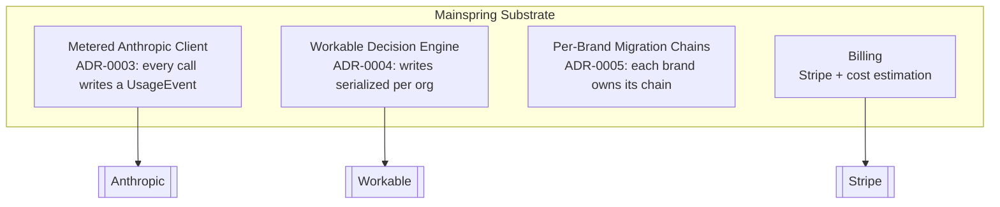

# View — Substrate Components (C4 L3)

> Derived from `../model.yaml` (`components` where `container: mainspring-substrate`).
> These are the invariant-bearing pieces agents most often get wrong. Each links to
> the ADR that makes it non-negotiable.

| Component                | Invariant | Today (verifiable in tali-platform)                                       |
| ------------------------ | --------- | ------------------------------------------------------------------------- |
| Metered Anthropic Client | ADR-0003  | `backend/app/services/metered_anthropic_client.py`, `.../metered_async_anthropic_client.py` |
| Workable Decision Engine | ADR-0004  | `backend/app/components/integrations/workable/service.py`, `.../sync_service.py` |
| Per-Brand Migrations     | ADR-0005  | `backend/alembic`                                                         |
| Billing                  | —         | `backend/app/services/pricing_service.py`, `.../credit_ledger_service.py` |

These migrate into `mainspring` (`migratesTo`) as legacy capabilities are drained.
