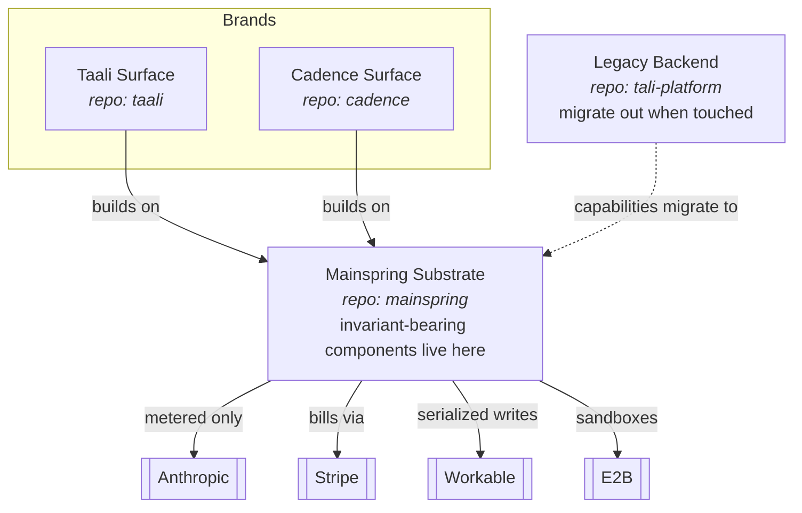

# View — Containers (C4 L2)

> Derived from `../model.yaml` (`containers`, `relationships`). Shows the
> substrate/brand topology and repo ownership. Refresh when the model changes.

**Reading guide:** brands build *on* the substrate — they never fork it. The substrate
owns everything cross-cutting, including the components that carry invariants. The
legacy backend is a source to drain into the substrate/brand model, not to extend.
