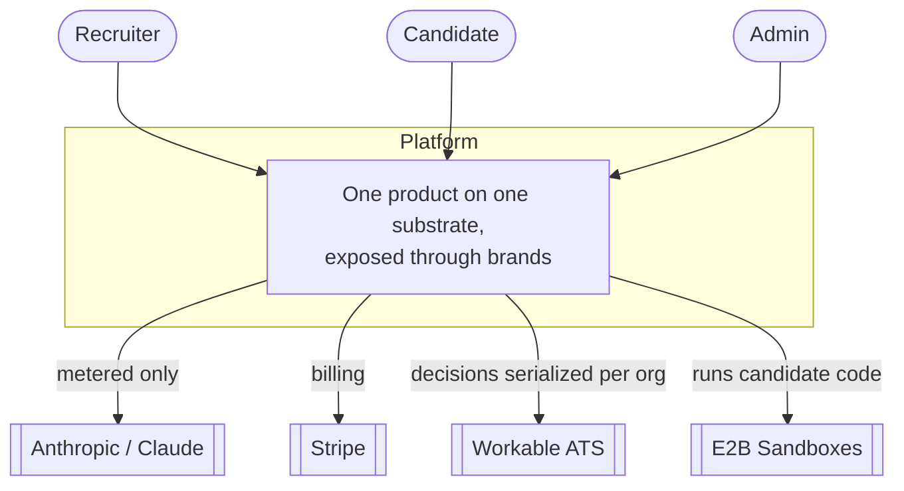

# View — System Context (C4 L1)

> Derived from `../model.yaml` (`context`). Rendered with plain Mermaid `flowchart`
> rather than Mermaid's experimental `C4Context` (see ADR-0006). If you change the
> model, refresh this view in the same PR.

**Actors:** Recruiters (create/review assessments), Candidates (take them), Admins
(platform settings/templates).

**External systems:** Anthropic (reached *only* via the metered client — ADR-0003),
Stripe (billing), Workable (ATS, serialized decision writes — ADR-0004), E2B (sandboxes).
